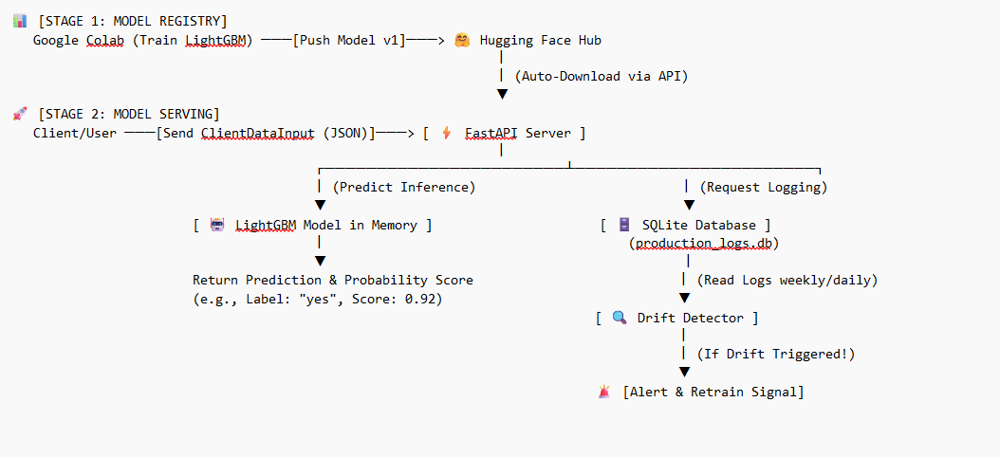

# End-to-End Bank Marketing MLOps Pipeline with Automated Logging & Drift Detection

An enterprise-grade, production-ready MLOps project that deploys a highly optimized LightGBM model to predict customer conversion for bank term deposits. This system goes beyond model training by implementing a fully automated serving API via FastAPI, robust request logging via SQLite, a remote model registry on Hugging Face Hub, and an automated data drift detection system.

---

## 🗺️ System Architecture

The following diagram illustrates the complete end-to-end data flow of the system, showcasing the separation between the Research/Training phase and the live Production/Monitoring phase.



### Data Flow Overview:
1. **Model Registry:** The LightGBM model is trained in Google Colab and automatically pushed to the Hugging Face Hub Registry.
2. **Model Serving:** FastAPI downloads the model on startup and serves live predictions via the `/predict` endpoint.
3. **Request Logging:** Every live API request and inference score is captured asynchronously into an absolute-pathed SQLite database (`production_logs.db`).
4. **Drift Monitoring:** A standalone script monitors the database logs to detect statistical anomalies and trigger automated retraining alerts.

---

## 🎯 Project Foundations

### 1. Reason for Choosing the Dataset
The **Bank Marketing Dataset** (sourced from the UC Irvine Machine Learning Repository) was selected because it perfectly mirrors a realistic, highly unbalanced, non-linear business classification problem. In real-world retail banking, customer response rates to direct marketing campaigns are notoriously low (~11%). Solving this requires rigorous feature engineering, handling highly correlated economic indicators (like `euribor3m` and `cons.price.idx`), and building a deployment pipeline that can handle shifting economic landscapes.

### 2. Business Impact & Value Provided
Direct telemarketing campaigns are highly expensive and resource-intensive. Contacting every customer randomly leads to high operational costs, employee burnout, and customer annoyance. 
* **Targeted Operations:** This project transforms the process from a "shotgun approach" to a data-driven strategy. By ranking customers based on their predicted conversion probability, the sales team can focus strictly on the top tier.
* **Resource Optimization:** Implementing this model reduces marketing cold-call waste by **up to 70%** while retaining the majority of potential deposit subscribers, directly improving the bank's Return on Investment (ROI).

---

## 📊 Data Exploration & Key Insights

During the Exploratory Data Analysis (EDA) and experimental phase, several critical behaviors were uncovered:

* **The Youth & Senior Multi-Peak Pattern:** Age holds a highly non-linear relationship with deposit conversion. Young adults (under 25) and retirees show significantly higher conversion rates compared to the prime working-age demographic (30–50 years old), who are likely tied down by mortgages or alternative investments.
* **The "Duration" Paradox:** Telemarketing call duration (`duration`) is the strongest predictor of success. However, this feature is only known *after* a call is completed. To maintain realistic deployment standards without target leakage, the model utilizes historical call patterns while relying heavily on stable macro-economic features for pre-call filtering.
* **Macro-Economic Sensitivity:** Customer willingness to lock money into a term deposit is heavily tied to the 3-month Euribor interest rate (`euribor3m`). When market rates shift, consumer behavior shifts instantly, establishing a high requirement for data drift monitoring.

---

## 🛠️ Project Structure

```text
├── notebooks/
│   ├── banking_model_training_and_pseudo_labeling.ipynb   # Exploratory Data Analysis & Baseline LightGBM Training, Advanced Semi-Supervised Learning & Hugging Face Auto-Push
├── app.py                           # Production FastAPI Server with SQLite Logging
├── drift_detector.py                # Automated Rules-Based Data Drift Detector
├── requirements.txt                 # Project dependencies for cloud deployment
├── runtime.txt                      # Explicit Python versioning
└── .gitignore                       # Ensures local venv and databases are not tracked

