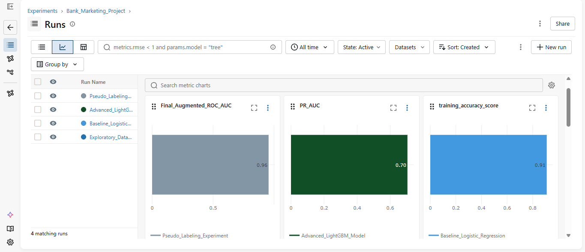
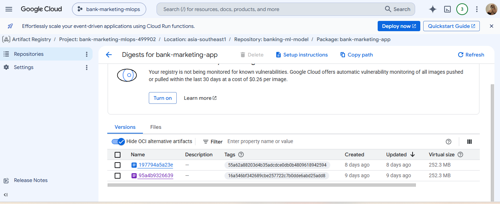
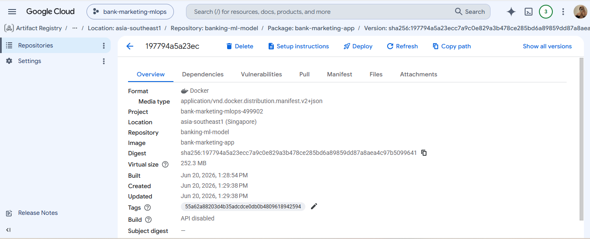
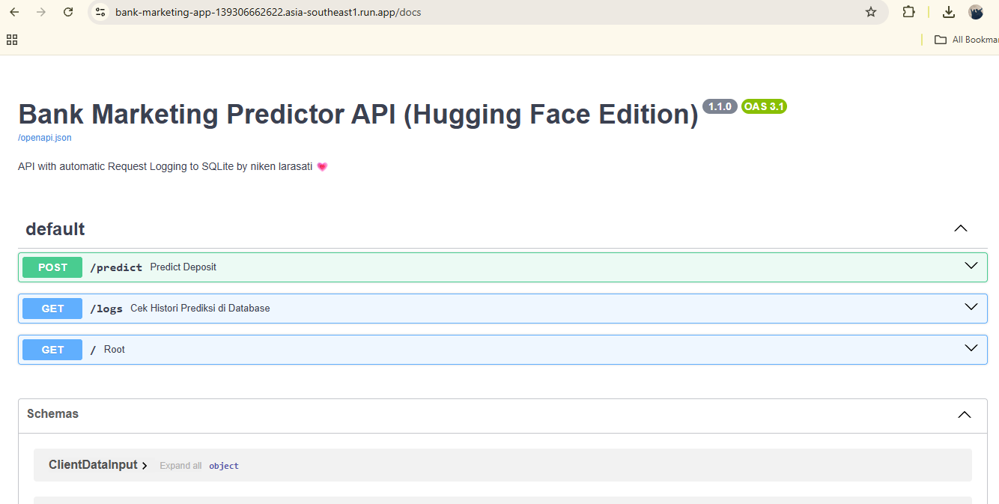
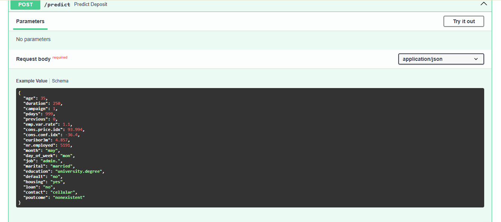
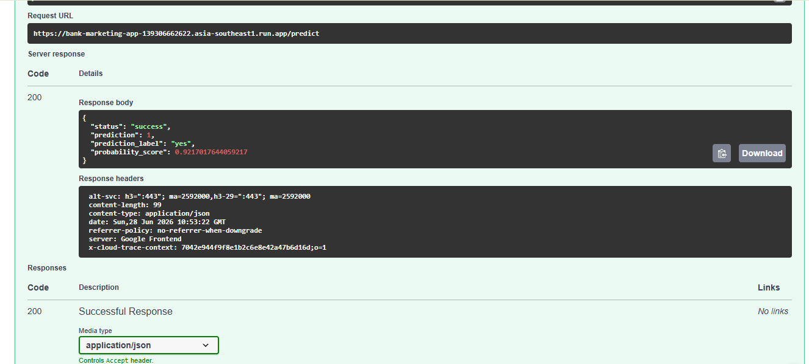

# End-to-End Bank Marketing MLOps Pipeline with Automated Logging & Drift Detection

An enterprise-grade, production-ready MLOps project that deploys a highly optimized LightGBM model to predict customer conversion for bank term deposits. This system goes beyond model training by implementing a fully automated containerized serving API via FastAPI, robust request logging via SQLite, continuous integration and deployment (CI/CD) via GitHub Actions, and container hosting on Google Cloud Platform.

---
## 🔗 Live Demo API
* **Interactive API Documentation:** [Live FastAPI on Google Cloud Run](https://bank-marketing-app-139306662622.asia-southeast1.run.app/docs) *(Automated Deployment)*
* **Legacy Space:** [FastAPI on Hugging Face Spaces](https://nikenlarash22-bank-marketing-api.hf.space/docs)


## 📊 Machine Learning Experiment Tracking (MLflow)
To maintain model reproducibility and track performance across different architectures, **MLflow** was integrated into the training pipeline. 

### Experiments Run:
- **Exploratory Data Analysis (EDA)**: Initial data shape and baseline checks.
- **Baseline Logistic Regression**: Simple benchmark model.
- **Advanced LightGBM Model**: Optimized gradient boosting tree.
- **Pseudo-Labeling Experiment**: Semi-supervised approach to leverage unlabelled data.

#### Model Performance Comparison (MLflow Chart View)

- **Pseudo-Labeling Experiment** achieved the highest ROC-AUC of **0.96**.
- **Advanced LightGBM Model** reached a PR-AUC of **0.70**.
- **Baseline Logistic Regression** maintained a stable training accuracy score of **0.91**.

### Model Containerization


*The model is packaged using Docker into the Google Artifact Registry (asia-southeast1) to ensure a consistent replication environment with an efficient image size of 252.3 MB.*

### Model Deployment & Serving

*The application is deployed serverless using Google Cloud Run. The endpoint provides interactive FastAPI documentation (Swagger UI) with automatic prediction features (/predict) and prediction history logging to a SQLite database (/logs).*

### Model API Testing and Validation



To ensure the model's reliability in a production environment, API testing was conducted directly through the interactive FastAPI documentation on Google Cloud Run. Testing was conducted by simulating the characteristics of new customers by modifying input parameters, such as changing the housing loan status (housing = no) and adjusting the initial productive age group (age = 25).
Test Results:
- HTTP Status Code: 200 OK, indicating the Google Cloud Run server successfully processed the JSON payload without error.
- Latency & Inferences: The model successfully performed inferences in real time and returned predictions of bank marketing conversion opportunities instantly.
- Data Logging: Each prediction activity is automatically logged to a SQLite database via the integrated request logging component.


## 🗺️ System Architecture & CI/CD Pipeline

The following diagram illustrates the complete end-to-end data flow and infrastructure automation of the system, showcasing the decoupling between the Training Phase and the live, automated Production deployment phase.

<!---->

### Data Flow & Automation Overview:
1. **Model Registry:** The LightGBM model is trained in Google Colab and automatically pushed to the Hugging Face Hub Registry.
2. **Containerization (Docker):** The FastAPI application is containerized locally/remotely using a multi-stage `Dockerfile` to enforce environment consistency.
3. **Continuous Integration (GitHub Actions):** Every code push to the `main` branch triggers an automated workflow that authenticates to GCP, builds the Docker image, and pushes it to **Google Artifact Registry**.
4. **Continuous Deployment (Google Cloud Run):** The fresh image is instantly pulled and serving live production traffic as a serverless microservice on **Google Cloud Run** (`asia-southeast1`).
5. **Request Logging:** Every live API request and inference score is captured asynchronously into an absolute-pathed SQLite database (`production_logs.db`).
6. **Drift Monitoring:** A standalone script monitors the database logs to detect statistical anomalies and trigger automated retraining alerts.

---

## 🎯 Project Foundations

### 1. Reason for Choosing the Dataset
The **Bank Marketing Dataset** (sourced from the UC Irvine Machine Learning Repository) was selected because it perfectly mirrors a realistic, highly unbalanced, non-linear business classification problem. In real-world retail banking, customer response rates to direct marketing campaigns are notoriously low (~11%). Solving this requires rigorous feature engineering, handling highly correlated economic indicators (like `euribor3m` and `cons.price.idx`), and building a deployment pipeline that can handle shifting economic landscapes.

### 2. Business Impact & Value Provided
Direct telemarketing campaigns are highly expensive and resource-intensive. Contacting every customer randomly leads to high operational costs, employee burnout, and customer annoyance. 
* **Targeted Operations:** This project transforms the process from a "shotgun approach" to a data-driven strategy. By ranking customers based on their predicted conversion probability, the sales team can focus strictly on the top tier.
* **Resource Optimization:** Implementing this model reduces marketing cold-call waste by **up to 70%** while retaining the majority of potential deposit subscribers, directly improving the bank's Return on Investment (ROI).

---

## 📊 Data Exploration & Key Insights

During the Exploratory Data Analysis (EDA) and experimental phase, several critical behaviors were uncovered:

* **The Youth & Senior Multi-Peak Pattern:** Age holds a highly non-linear relationship with deposit conversion. Young adults (under 25) and retirees show significantly higher conversion rates compared to the prime working-age demographic (30–50 years old), who are likely tied down by mortgages or alternative investments.
* **The "Duration" Paradox:** Telemarketing call duration (`duration`) is the strongest predictor of success. However, this feature is only known *after* a call is completed. To maintain realistic deployment standards without target leakage, the model utilizes historical call patterns while relying heavily on stable macro-economic features for pre-call filtering.
* **Macro-Economic Sensitivity:** Customer willingness to lock money into a term deposit is heavily tied to the 3-month Euribor interest rate (`euribor3m`). When market rates shift, consumer behavior shifts instantly, establishing a high requirement for data drift monitoring.

---

## 🛠️ Project Structure & Infrastructure Stack

### MLOps Infrastructure:
* **CI/CD Automation:** GitHub Actions
* **Containerization Engine:** Docker
* **Cloud Platform Hosting:** Google Cloud Platform (Artifact Registry & Cloud Run)

```text
├── .github/
│   └── workflows/
│       └── deploy.yml               # GitHub Actions CI/CD deployment configurations
├── notebooks/
│   ├── banking_model_training_and_pseudo_labeling.ipynb   # EDA, Baseline LightGBM & HF Auto-Push
├── app.py                           # Production FastAPI Server with SQLite Logging
├── drift_detector.py                # Automated Rules-Based Data Drift Detector
├── Dockerfile                       # Production container blueprint
├── requirements.txt                 # Project dependencies for cloud deployment
├── runtime.txt                      # Explicit Python versioning
└── .gitignore                       # Ensures local venv and databases are not tracked

```

## 🧠 Personal Reflections & Engineering Growth
Building this end-to-end ecosystem provided immense engineering growth and reshaped my perspective on machine learning projects.

MLOps is Superior to Static Modeling: A model with 95% accuracy is completely useless if it sits as a static file on a local computer. Learning how to package features into an abstract Pydantic contract, containerize it using Docker, and serve it live via FastAPI and Google Cloud Run bridged the gap between pure data science and software engineering.

Automated CI/CD & Cloud Infrastructure: Implementing GitHub Actions workflows to manage continuous integration taught me the immense power of automated testing, building, and deployment pipelines. Transitioning to Google Cloud Run provided deep experience in production-level environment variables, secure IAM service accounts, and enterprise artifact management.

The Danger of Data Over-Confidence: Witnessing how easily an economic shift (drift) can degrade model assumptions taught me that model deployment is never a "one-and-done" task. Continuous monitoring is mandatory.

Infrastructural Efficiency: Transitioning from heavy local storage dependencies to an automated cloud architecture (pushing/pulling from Hugging Face Hub using Fine-Grained tokens) proved that production systems must be lightweight, secure, and decoupled.

Created by: Niken Larasati Winasih